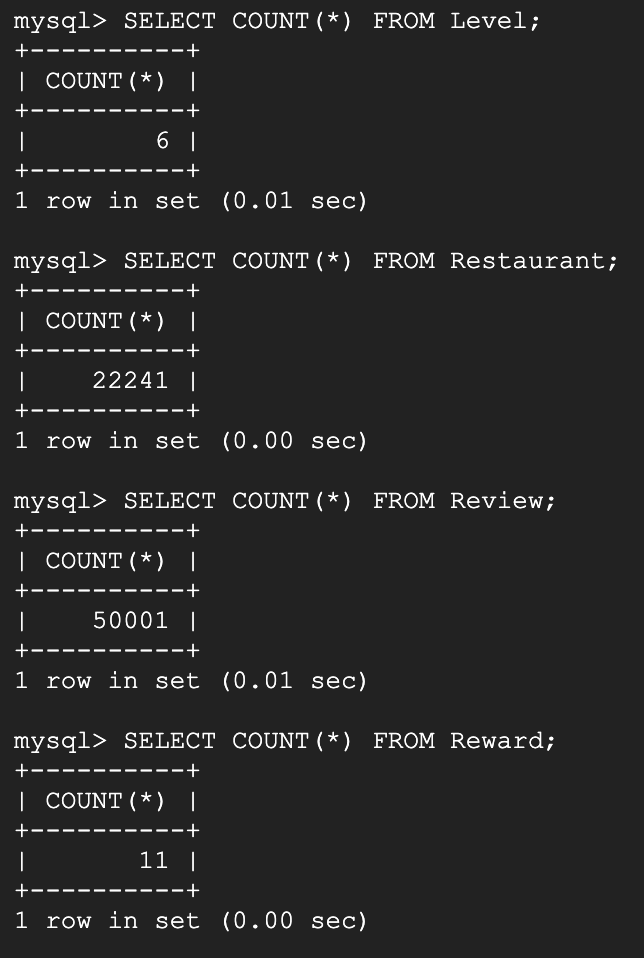
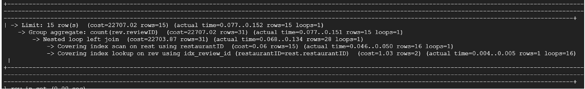

# Database Implementation and Indexing

## Database DDL Commands

### Entity Tables:
```

    DROP TABLE IF EXISTS Level;
    CREATE TABLE Level (
        levelName  VARCHAR(30) PRIMARY KEY NOT NULL,
        levelDescription   VARCHAR(350) NOT NULL
    );
    
    DROP TABLE IF EXISTS User;
    
    CREATE TABLE User (
        userName   VARCHAR(30) PRIMARY KEY NOT NULL,
        Email   VARCHAR(30) NOT NULL,
        Password  VARCHAR(30) NOT NULL,
        levelName   VARCHAR(30) NOT NULL,
        FOREIGN KEY (levelName) REFERENCES Level(levelName)
    );
    
    DROP TABLE IF EXISTS Restaurant;
    CREATE TABLE Restaurant (
        restaurantID VARCHAR(30) NOT NULL,
        name VARCHAR(50) NOT NULL,
        address VARCHAR(100) NOT NULL,
        city VARCHAR(30) NOT NULL,
        state VARCHAR(2) NOT NULL,
        rating DECIMAL(2, 1) NOT NULL,
        reviewCount INT  DEFAULT 0,
        cuisine VARCHAR(30) NOT NULL,
        priceRange VARCHAR(1) NOT NULL,
        PRIMARY KEY (name, address, city, state),
        UNIQUE (restaurantID) 
    );
    
    DROP TABLE IF EXISTS Review;
    CREATE TABLE Review (
        reviewID VARCHAR(30) PRIMARY KEY NOT NULL,
        userName  VARCHAR(30) NOT NULL,
        restaurantID  VARCHAR(30) NOT NULL,
        totalLikes  INT NOT NULL,
        rating DECIMAL(2, 1) NOT NULL,
        description   VARCHAR(1250) NOT NULL,
        FOREIGN KEY (userName) REFERENCES User(userName),
        FOREIGN KEY (restaurantID) REFERENCES Restaurant(restaurantID)
    );
    
    DROP TABLE IF EXISTS Challenge;
    CREATE TABLE Challenge (
        challengeName VARCHAR(30) PRIMARY KEY NOT NULL,
        description VARCHAR(100) NOT NULL
    );
    
    DROP TABLE IF EXISTS Reward;
    CREATE TABLE Reward (
        rewardName  VARCHAR(50) PRIMARY KEY NOT NULL,
        description VARCHAR(100) NOT NULL,
        state VARCHAR(2) NOT NULL
       );
```

### Relationship Tables:
Relationship 1 - LikeReview (many-to-many between User and Review)
```

    DROP TABLE IF EXISTS LikeReview ;
    CREATE TABLE LikeReview (
      reviewID VARCHAR(30) NOT NULL,
      username VARCHAR(30) NOT NULL,
      PRIMARY KEY (reviewID, username),
      FOREIGN KEY (reviewID) REFERENCES Review(reviewID),
      FOREIGN KEY (username) REFERENCES User(username)
    );
   
```

Relationship 2 - Favorite (many-to-many between User and Restaurant)
```

    DROP TABLE IF EXISTS Favorite;
    CREATE TABLE Favorite (
      username VARCHAR(30) NOT NULL,
      restaurantID VARCHAR(30) NOT NULL,
      PRIMARY KEY (username, restaurantID),
      FOREIGN KEY (username) REFERENCES User(username),
      FOREIGN KEY (restaurantID) REFERENCES Restaurant(restaurantID)
    );
 
```

Relationship 3 - Owns (many-to-many between User and Reward)
```

    DROP TABLE IF EXISTS Owns ;
    CREATE TABLE Owns (
        username VARCHAR(30) NOT NULL,
        rewardName VARCHAR(50) NOT NULL,
        PRIMARY KEY (username, rewardName),
        FOREIGN KEY (username) REFERENCES User(username),
        FOREIGN KEY (rewardName) REFERENCES Reward(rewardName)
    );

```

Relationship 4 - HasCompleted (many-to-many between User and Challenge)
```

    DROP TABLE IF EXISTS ChallengeCompleteTime ;
    CREATE TABLE ChallengeCompleteTime (
        username VARCHAR(30) NOT NULL,
        challengeName VARCHAR(30) NOT NULL,
        completeTime TIME NOT NULL,
        PRIMARY KEY (username, challengeName),
        FOREIGN KEY (username) REFERENCES User(username),
        FOREIGN KEY (challengeName) REFERENCES Challenge(challengeName)
    );

```

Relationship 5 - ChallengeFor (many-to-many between Restaurant and Challenge)
```

    DROP TABLE IF EXISTS ChallengeFor ;
    CREATE TABLE ChallengeFor (
        challengeName VARCHAR(30) NOT NULL,
        restaurantID VARCHAR(30) NOT NULL,
        startTime TIME NOT NULL,
        endTime TIME NOT NULL,
        PRIMARY KEY (challengeName, restaurantID),
        FOREIGN KEY (challengeName) REFERENCES Challenge(challengeName),
        FOREIGN KEY (restaurantID) REFERENCES Restaurant(restaurantID)
    );

```

Relationship 6 - Relationship HasReward (many-to-many between Challenge and Reward)
```

    DROP TABLE IF EXISTS HasReward ;
    CREATE TABLE HasReward (
        rewardName VARCHAR(50) NOT NULL,
        challengeName VARCHAR(30) NOT NULL,
        PRIMARY KEY (rewardName, challengeName),
        FOREIGN KEY (rewardName) REFERENCES Reward(rewardName),
        FOREIGN KEY (challengeName) REFERENCES Challenge(challengeName)
    );

```

Relationship 7 - AssociatedWith (many-to-many between Level and Reward)
```

    DROP TABLE IF EXISTS AssociatedWith ;
    CREATE TABLE AssociatedWith (
        rewardName VARCHAR(50) NOT NULL,
        levelName VARCHAR(30) NOT NULL,
        PRIMARY KEY (rewardName, levelName),
        FOREIGN KEY (rewardName) REFERENCES Reward(rewardName),
        FOREIGN KEY (levelName) REFERENCES Level(levelName)
    );

```

We have implemented a database called __ver3__ on Google GCP as seen below. 


Currently we have implemented 5 entity tables, relationships DDL queries are built just not implemented in this table just yet. 


### Inserting Data
For this half of this stage - we used our Yelp and Kaggle datasets for User, Review and Restaurant, with some auto generated data for entity Levels, Reward, and Challenge as neither dataset contained anything similar. 




### Advanced SQL Queries

We have developed a total of 4 advanced queries:

1. Find the average ratings for each restaurant.
```

  SELECT 
      r.restaurantID, 
      AVG(rv.rating) AS average_rating 
  FROM 
      Restaurant r JOIN  Review rv ON r.restaurantID = rv.restaurantID 
  GROUP BY 
      r.restaurantID
  LIMIT 15 ;

```


2. Find review counts per user and the number of likes their review received.
```

  SELECT 
      u.username, 
      COUNT(rv.reviewID) AS total_reviews, 
      SUM(rv.totalLikes) AS total_likes_received 
  FROM 
      User u 
  LEFT JOIN 
      Review rv ON u.username = rv.username 
  GROUP BY 
      u.username
  LIMIT 15 ;

```


3. Find review counts per each restaurant.
```

  SELECT 
      rest.name, 
      COUNT(rev.reviewID) AS total_reviews 
  FROM 
      Restaurant rest 
  LEFT JOIN 
      testReviews rev ON rest.restaurantID = rev.restaurantID 
  GROUP BY 
      rest.restaurantID
  LIMIT 15 ;

```


4. Find average cuisine ratings.
```

  SELECT 
      r.cuisine, 
      r.name, 
      AVG(rv.rating) AS AverageRating 
  FROM 
      Restaurant r 
  JOIN 
      Review rv ON rv.restaurantID = r.restaurantID 
  GROUP BY 
      r.cuisine
  ORDER BY 
      r.cuisine, AverageRating DESC
  LIMIT 15 ;

```


### Indexing Analysis:

#### Query 1: Find the average ratings for each restaurant.
```
SELECT 
    r.restaurantID, 
    AVG(rv.rating) AS average_rating 
FROM 
    Restaurant r JOIN  Review rv ON r.restaurantID = rv.restaurantID 
GROUP BY 
    r.restaurantID
LIMIT 15 ;
```

Expect analysis for the original query: (default index)


After we add index on Review.rating, we get:

<br>We can see that the cost of the nested loop, table scan on rv, and single-row doesn’t change. The reason might be that Review.rating is in the aggregate function, which execution cost doesn’t change when adding the indexes.

After we add index on Restaurant.restaurantID:

<br>We can see again that the cost of the nested loop, table scan on rv, and the single-row doesn’t change. The reason might be that Restaurant.restaurantID is used in the ‘group by’ clause, whose execution cost doesn’t change when adding the indexes.

After we add index on Review.restaurantID:

<br>We can see that all of the cost of the nested loop, table scan on rv, and the single-row drops significantly.

#### Query 2: Find review counts per user and the number of likes their review received.
```
SELECT 
    u.username, 
    COUNT(rv.reviewID) AS total_reviews, 
    SUM(rv.totalLikes) AS total_likes_received 
FROM 
    User u 
LEFT JOIN 
    Review rv ON u.username = rv.username 
GROUP BY 
    u.username
LIMIT 15 ;
```

Expect analysis for the original query: (default index)


After we add index on Review.totalLikes, we get:


We can see that the cost of the left hash join,converting index scan, and the table scan on rv doesn’t change. The reason might be that Review.totalLikes is used in the sum() aggregate function, whose execution cost doesn’t change when adding the indexes.

After we add index on Review.username, we get:


Now we can see that the cost of the limit, nested loop left join, converting index scan, and index look up on rv decrease much more than before. The reason might be that Review.username is neither in aggregate function nor in group by clause.

#### Query 3: Find review counts per each restaurant.
```
SELECT 
    rest.name, 
    COUNT(rev.reviewID) AS total_reviews 
FROM 
    Restaurant rest LEFT JOIN Review  rev ON rest.restaurantID = rev.restaurantID 
GROUP BY 
    rest.restaurantID
LIMIT 15 ;
```
Expect analysis for the original query: (default index)


After we add index on Restaurant.restaurantID, we get the following, which has the exact same cost even though restaurantID is not a primary key in Restaurant:


After we add index on Review.restaurantID, we get the following, which has the exact same cost even though restaurantID is not a primary key in Review:


After we index on both Restaurant.restaurantID and Review.restaurantID, we get the following, which has the exact same cost even though restaurantID is not a primary key.
No difference may be due to that The GROUP BY clause on rest.restaurantID might require the database to scan the entire result set anyway, reducing the benefit of using an index for the join. Alternatively, If the data is not well-distributed (e.g., if most reviews are for a small number of restaurants), the database might decide that using the index is not beneficial.


#### Query 4: Find the average ratings by cuisine and restaurant name..
```
SELECT 
    r.cuisine, 
    r.name, 
    AVG(rv.rating) AS AverageRating 
FROM 
    Restaurant r 
JOIN 
    Review rv ON rv.restaurantID = r.restaurantID 
GROUP BY 
    r.cuisine, r.name 
ORDER BY 
    r.cuisine, AverageRating DESC
LIMIT 15 ;
```

Expect analysis for the original query: (default index):


After index on Restaurant(cuisine):
An explanation why it stays the same is that while it might help with the ORDER BY clause, the database still needs to perform the join and aggregation before sorting.
From what we can see, nothing much has altered in regard to the cost when we add this index on the cuisine attribute. The  cost is the same at 23988.9 after adding in this index.


Adding index on rv.restaurantID:
The cost after adding in an index on the restaurantID for review reduced to 20960 from 23988 previously. This is due to the index scan on review which reduces the number of disk operations needed. It helps optimize the join operation between Restaurant and Review tables. The database can use this index to quickly find matching reviews for each restaurant.


Adding index on r.restaurantID:
When adding in the index on the restaurantID for Restaurant, the cost remains the same as our default query without indexing, even though restaurantID is not the primary key in the restaurant. 


#### Conclusion
The following shows the total cost of each index configuration for each query:


Based on the cost analysis, it is best to create indexes on:
1. Review.restaurantID
2. Review.username
